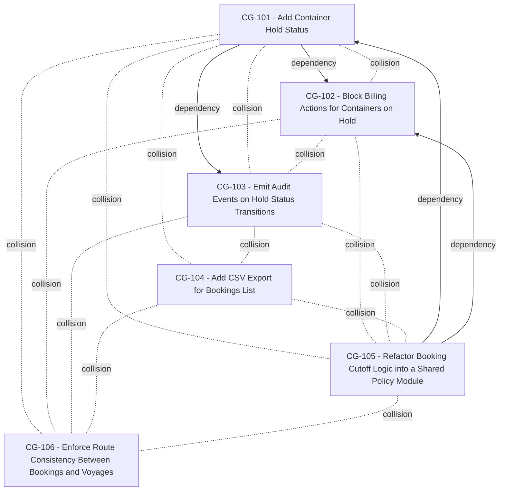

# run the app

---

**Status:** active  **Date:** 2026-08-30

---

### 👤 User

run the app

---

### 🤖 Assistant

> 🔧 called: list_files, read_file

Let me first look at the project structure to understand what kind of app this is.

> 🔧 **list_files** — .

> 🔧 **read_file** — package.json

### 🤖 Assistant

This is a full-stack app with a `server` and `client`. The `dev` script runs both concurrently. Since this is a long-running process, you'll need to run it in your own terminal:

```bash
npm run dev
```

This will start both the **server** (cyan) and **client** (magenta) in parallel using `concurrently`. Run this from the root of the project (`/Users/tejasramramesh/Documents/GitHub/BOB_THE_BUILDER/BOB_THE_BUILDER`).

---

### 👤 User

display the change-graph.md

---

### 🤖 Assistant

> 🔧 called: read_file, list_files, glob, read_file


> 🔧 **read_file** — change-requests/change-graph.md

> 🔧 **list_files** — change-requests

> 🔧 **glob** — **/change-graph.md

> 🔧 **read_file** — changeguard/.changeguard/change-graph.md

### 🤖 Assistant

Here is the [`change-graph.md`](changeguard/.changeguard/change-graph.md) from ChangeGuard:

---

**Generated:** 2026-08-30T04:15:38Z

## Logical Dependencies

| From | To | Confidence |
|------|----|------------|
| CG-105 | CG-101 | 95% |
| CG-101 | CG-102 | 95% |
| CG-101 | CG-103 | 98% |
| CG-105 | CG-102 | 95% |

## Change Collisions

| Pair | Confidence |
|------|------------|
| CG-101 ↔ CG-102 | 92% |
| CG-101 ↔ CG-103 | 95% |
| CG-101 ↔ CG-104 | 90% |
| CG-101 ↔ CG-105 | 100% |
| CG-101 ↔ CG-106 | 95% |
| CG-102 ↔ CG-103 | 95% |
| CG-102 ↔ CG-105 | 100% |
| CG-102 ↔ CG-106 | 95% |
| CG-103 ↔ CG-104 | 82% |
| CG-103 ↔ CG-105 | 95% |
| CG-103 ↔ CG-106 | 95% |
| CG-104 ↔ CG-105 | 90% |
| CG-104 ↔ CG-106 | 75% |
| CG-105 ↔ CG-106 | 95% |

> _All tickets have at least one dependency or collision relationship._

## Graph

