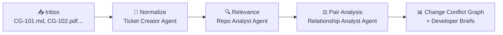
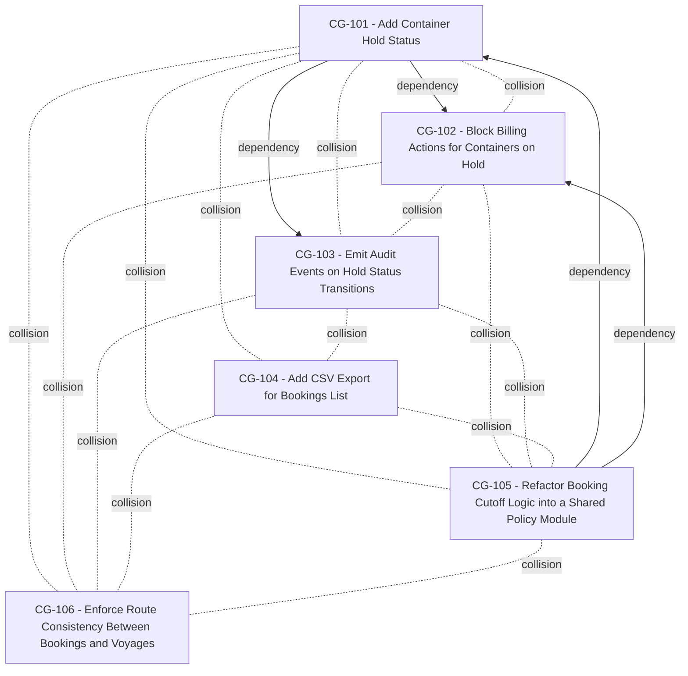

# I am now preparing a presentation to speak on changeguard.... help prepare a script to present our changeguard solution

---

**Status:** active  **Date:** 2026-08-30

---

### 👤 User

I am now preparing a presentation to speak on changeguard.... help prepare a script to present our changeguard solution

---

### 🤖 Assistant

> 🔧 called: list_files, list_files, read_file, read_file, read_file, read_file, read_file, read_file, read_file, read_file, read_file, read_file, read_file, read_file, read_file, read_file


> 🔧 **list_files** — .

> 🔧 **read_file** — README.md

> 🔧 **list_files** — changeguard

> 🔧 **read_file** — changeguard/changeguard.yaml

> 🔧 **read_file** — changeguard/src/changeguard/models.py

> 🔧 **read_file** — changeguard/src/changeguard/orchestrator.py

> 🔧 **read_file** — changeguard/src/changeguard/cli.py

> 🔧 **read_file** — changeguard/src/changeguard/analysis/relationship.py

> 🔧 **read_file** — changeguard/.changeguard/change-graph.md

> 🔧 **read_file** — changeguard/.changeguard/reports/CG-101.md

> 🔧 **read_file** — changeguard/.changeguard/reports/CG-102.md

> 🔧 **read_file** — changeguard/.changeguard/normalized/CG-101.md

> 🔧 **read_file** — changeguard/src/changeguard/repository/relevance.py

> 🔧 **read_file** — changeguard/src/changeguard/ingestion/normalizer.py

> 🔧 **read_file** — changeguard/src/changeguard/graph/builder.py

> 🔧 **read_file** — changeguard/src/changeguard/report/generator.py

### 🤖 Assistant

> 🔧 called: list_files, read_file, read_file, read_file

Now let me read a few more files to get the full picture — the change requests in the inbox and the remaining reports:

> 🔧 **list_files** — change-requests

> 🔧 **read_file** — changeguard/.changeguard/reports/CG-106.md

> 🔧 **read_file** — changeguard/.changeguard/reports/CG-103.md

> 🔧 **read_file** — changeguard/src/changeguard/report/context.py

### 🤖 Assistant

I now have a thorough understanding of the entire ChangeGuard system. Here is a complete, structured presentation script you can use:

---

# 🎤 ChangeGuard — Presentation Script

---

## SLIDE 1 — Opening / The Problem

**[Say]**

> "Every engineering team I've worked with has faced the same painful scenario: two developers, working on separate tickets, unknowingly making conflicting changes to the same file — and nobody finds out until the merge. Or worse: a developer starts building a feature that depends on infrastructure that hasn't landed yet, and the PR reviewer is the first person to notice.
>
> These problems aren't caused by bad developers. They're caused by a lack of *change intelligence* — nobody has a clear view of *how* the tickets in flight relate to each other.
>
> That's the problem ChangeGuard solves."

---

## SLIDE 2 — What is ChangeGuard?

**[Say]**

> "ChangeGuard is an AI-powered change intelligence pipeline. You drop your change request documents into an inbox — Markdown, PDF, DOCX, plain text — run a single command, and ChangeGuard produces two things:
>
> **First**, a Change Conflict Graph — a full map of every logical dependency and file collision across all in-flight tickets.
>
> **Second**, a Developer Brief for each ticket — a human-readable, 60-second read that tells a developer exactly what they're walking into before they write a single line of code."

---

## SLIDE 3 — The Pipeline (Architecture)

**[Say]**

> "Let me walk you through how ChangeGuard works under the hood. It's a four-stage pipeline."

Show this diagram:



**[Say]**

> "**Stage 1 — Normalize.** Raw change requests come in every shape and format. The Ticket Creator Agent reads each document and produces a canonical, structured representation: a normalized Markdown file and a typed JSON object with the ticket's title, summary, requirements, and acceptance criteria.
>
> **Stage 2 — Repository Relevance.** The Repo Relevance Analyst Agent reads the normalized ticket and the actual codebase — file tree, key source files, snippets — and predicts which modules, files, and symbols are likely to be affected. It assigns a confidence score to each prediction.
>
> **Stage 3 — Pair Relationship Analysis.** For every pair of tickets, the Relationship Analyst Agent compares their normalized content and relevance predictions and asks two questions: Is there a *logical dependency* between these two? Is there a *change collision*? Each answer comes with a confidence score and supporting evidence.
>
> **Stage 4 — Graph and Reports.** All pair analyses are assembled into a Change Conflict Graph — nodes are tickets, edges are dependencies and collisions — rendered as both JSON and a Mermaid diagram. Then for each ticket, the Report Agent writes a developer brief synthesizing everything: what to do first, who to coordinate with, and what files are hot."

---

## SLIDE 4 — Live Example: The Change Conflict Graph

**[Say]**

> "Let me show you a real example. We have six in-flight tickets for a shipping container booking system."

Show the graph:



**[Say]**

> "Solid arrows are logical dependencies — meaning one ticket *cannot be built* before the other. The dotted lines are change collisions — tickets that are touching the same files or modules concurrently.
>
> What you're seeing here is a picture that would have taken a tech lead several hours to reconstruct manually from six separate Jira tickets. ChangeGuard produced it in minutes, fully automatically, powered by Gemini."

---

## SLIDE 5 — The Developer Brief

**[Say]**

> "The graph is the macro view. The developer brief is the micro view — written specifically for the engineer picking up a ticket."

Show an excerpt from the CG-101 brief:

> **CG-101 — Add Container Hold Status**
> **Status:** ⚠️ Prerequisites + coordination required
>
> **Before you start:**
> CG-105 (Refactor Booking Cutoff Logic) is a mandatory prerequisite. Do *not* modify the `LIFECYCLE` array in `bookings.ts` until CG-105 is merged — otherwise you will face significant merge conflicts and likely break the new architecture.
>
> **Watch for collisions:**
> CG-103 will also be modifying the same route handlers to add audit hooks. CG-102 depends directly on your work.

**[Say]**

> "This is the kind of brief a senior engineer would give a new team member in a 10-minute handoff meeting — except it's available instantly for every ticket, generated from the actual codebase and the actual change requests. No tribal knowledge required."

---

## SLIDE 6 — Two Relationship Dimensions

**[Say]**

> "I want to call out one important design decision: ChangeGuard distinguishes between *two independent types of relationships*."

| Relationship | What it means | Directionality |
|---|---|---|
| **Logical Dependency** | Ticket B *requires* work from Ticket A to exist | Directional (A → B) |
| **Change Collision** | Both tickets touch the same files or modules | Non-directional (A ↔ B) |

**[Say]**

> "These are completely different risks. A logical dependency means sequencing — you cannot even start B until A ships. A change collision means coordination — both developers need to be aware they're editing the same code.
>
> A collision does *not* imply a dependency. A dependency does *not* imply a collision. Conflating them leads to bad prioritization calls. ChangeGuard keeps them separate and reasons about each independently."

---

## SLIDE 7 — How to Run It

**[Say]**

> "The interface is a simple CLI."

```bash
# Drop change requests into the inbox, then:
changeguard run

# Generate a developer brief for a specific ticket:
changeguard report CG-101
```

**[Say]**

> "ChangeGuard is stateful — it tracks which tickets have been processed. When new tickets are added to the inbox, only the new pairs are analyzed. Existing results are cached. The graph is rebuilt incrementally."

---

## SLIDE 8 — Configuration

**[Say]**

> "Setup is a single YAML file."

```yaml
version: 1
llm:
  model: gemini-2.5-flash
repository:
  path: ..
change_requests:
  inbox: ../change-requests/inbox
output:
  root: ./.changeguard
analysis:
  dependency_confidence_threshold: 0.70
  collision_confidence_threshold: 0.70
```

**[Say]**

> "You point it at your repository, your inbox, and choose your LLM. The confidence thresholds control what edges appear in the graph — raising them reduces noise, lowering them increases sensitivity. The tool supports Gemini today via the OpenAI-compatible endpoint, and can be swapped to any OpenAI-compatible model."

---

## SLIDE 9 — What Makes It Work

**[Say]**

> "Three things make ChangeGuard more than just an LLM wrapper:
>
> **1. Structured, deterministic context.** Before any LLM call, ChangeGuard assembles a precise, typed context object — the normalized ticket, the relevance analysis, the graph edges, the collision set. The LLM receives clean structured data, not a wall of prose.
>
> **2. Separation of concerns across agents.** Each agent has a focused job with a locked JSON output schema. The Normalizer cannot speculate. The Relevance Analyst cannot add implementation steps. The Relationship Analyst is the only one reasoning about cross-ticket relationships. This prevents hallucination from spreading across pipeline stages.
>
> **3. Correctness enforcement post-LLM.** The `independent` flag on every pair analysis is *recalculated deterministically* after the LLM responds — `independent = not dep_exists and not col_exists` — regardless of what the model returned. Business logic is never left to the model."

---

## SLIDE 10 — Summary

**[Say]**

> "To wrap up:
>
> ChangeGuard gives engineering teams a real-time, AI-generated map of how their in-flight work is connected — *before* developers start coding.
>
> It eliminates the hidden cost of merge surprises, re-work due to missing prerequisites, and the 30-minute 'wait, were you changing that file too?' conversations.
>
> It doesn't replace engineers — it gives them the context a senior engineer would provide, automatically, for every ticket, every time."

---

**💡 Tips for delivery:**
- For Slide 4, have the Mermaid diagram rendered live — it's the most visually striking part of the demo.
- For Slide 5, consider doing a **live terminal demo**: run `changeguard report CG-101` and show the console output, then open the generated `.changeguard/reports/CG-101.md` in a viewer.
- The two-relationship-dimension point (Slide 6) tends to land well with technical audiences — it shows thoughtful design rather than a simple "AI reads tickets."