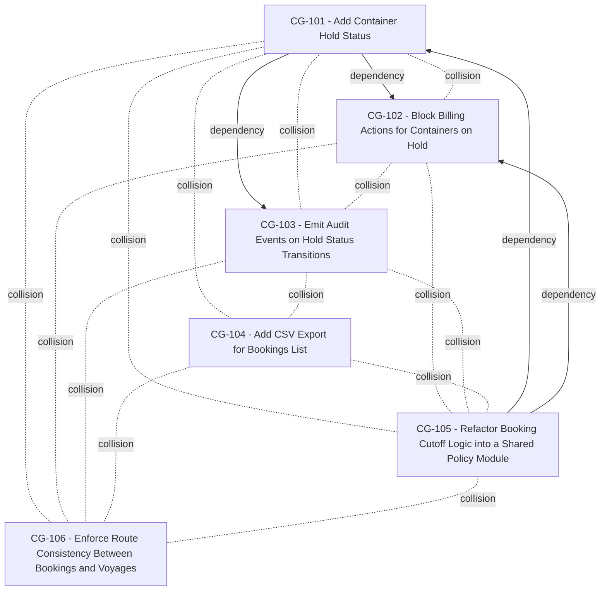

# ChangeGuard Analysis

Generated: 2026-08-30T04:15:38Z

## Logical Dependencies

### CG-101 → CG-102

**Confidence:** 95%

### CG-101 → CG-103

**Confidence:** 98%

### CG-105 → CG-101

**Confidence:** 95%

### CG-105 → CG-102

**Confidence:** 95%

## Change Collisions

### CG-101 ↔ CG-102

**Confidence:** 92%

### CG-101 ↔ CG-103

**Confidence:** 95%

### CG-101 ↔ CG-104

**Confidence:** 90%

### CG-101 ↔ CG-105

**Confidence:** 100%

### CG-101 ↔ CG-106

**Confidence:** 95%

### CG-102 ↔ CG-103

**Confidence:** 95%

### CG-102 ↔ CG-105

**Confidence:** 100%

### CG-102 ↔ CG-106

**Confidence:** 95%

### CG-103 ↔ CG-104

**Confidence:** 82%

### CG-103 ↔ CG-105

**Confidence:** 95%

### CG-103 ↔ CG-106

**Confidence:** 95%

### CG-104 ↔ CG-105

**Confidence:** 90%

### CG-104 ↔ CG-106

**Confidence:** 75%

### CG-105 ↔ CG-106

**Confidence:** 95%

## Independent Changes

_All tickets have at least one dependency or collision relationship._

## Graph

