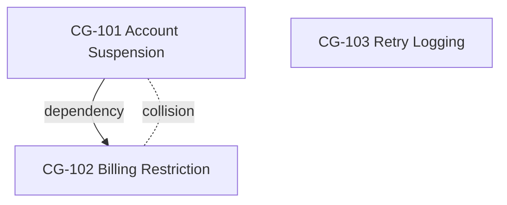

# ChangeGuard — Final Bob Implementation Instructions

## 1. Product Goal

ChangeGuard is a hackathon prototype that analyzes a folder of pending software change tickets against an existing demo application repository.

It helps developers understand:

- which tickets logically depend on other tickets;
- which tickets are likely to collide because they affect the same or tightly coupled parts of the codebase;
- which tickets appear independent;
- the overall relationship between pending changes through a Change Conflict Graph.

ChangeGuard does **not** implement the requested code changes.

Its purpose is to provide change intelligence **before implementation begins**.

The MVP pipeline is:

```text
Ticket Inbox
    ↓
Ticket Normalization
    ↓
Repository Relevance Analysis
    ↓
Pairwise Relationship Analysis
    ↓
Change Conflict Graph
```

Keep the implementation focused on this pipeline.

---

# 2. Hackathon Scope

Implement only:

1. Scan the demo application's ticket inbox.
2. Detect tickets that have not been processed yet.
3. Convert supported ticket files to normalized Markdown.
4. Create a small structured JSON representation for each ticket.
5. Analyze each ticket against the demo application's repository.
6. Store structured repository relevance analysis per ticket.
7. Compare pending tickets pairwise.
8. Detect:
   - logical dependencies;
   - change collisions;
   - independence.
9. Store structured pairwise relationship analysis.
10. Generate a Change Conflict Graph.
11. Maintain simple ticket processing status so completed tickets are skipped on future runs.
12. Process newly added tickets incrementally.

Do **not** implement:

- Jira integration;
- GitHub Issues integration;
- ticket APIs;
- databases;
- message queues;
- background filesystem watchers;
- ticket hashing;
- complex ticket versioning;
- implementation planning;
- source-code generation;
- source-code modification;
- pull request creation;
- release planning;
- backend/frontend/test specialist analyst agents;
- autonomous coding agents;
- dashboards;
- deployment systems.

Do not over-engineer the MVP.

---

# 3. Repository Structure

The hackathon repository contains both the demo application and ChangeGuard as separate projects.

Use this structure:

```text
repo-root/
│
├── demo-app/
│   ├── src/
│   ├── tests/
│   ├── README.md
│   │
│   └── change-requests/
│       ├── inbox/
│       │   ├── CG-101.pdf
│       │   ├── CG-102.docx
│       │   ├── CG-103.md
│       │   └── CG-104.txt
│       │
│       └── attachments/
│           ├── architecture.pdf
│           ├── api-notes.md
│           └── requirements.md
│
├── changeguard/
│   ├── src/
│   │   └── changeguard/
│   │       ├── orchestrator.py
│   │       ├── state.py
│   │       ├── models.py
│   │       ├── config.py
│   │       │
│   │       ├── ingestion/
│   │       │   ├── extractors.py
│   │       │   └── normalizer.py
│   │       │
│   │       ├── repository/
│   │       │   └── relevance.py
│   │       │
│   │       ├── analysis/
│   │       │   ├── pair_generator.py
│   │       │   └── relationship.py
│   │       │
│   │       └── graph/
│   │           ├── builder.py
│   │           └── renderer.py
│   │
│   ├── .changeguard/
│   │   ├── state.json
│   │   │
│   │   ├── normalized/
│   │   │   ├── CG-101.md
│   │   │   ├── CG-102.md
│   │   │   └── CG-103.md
│   │   │
│   │   ├── requests/
│   │   │   ├── CG-101.json
│   │   │   ├── CG-102.json
│   │   │   └── CG-103.json
│   │   │
│   │   ├── analysis/
│   │   │   ├── tickets/
│   │   │   │   ├── CG-101.json
│   │   │   │   ├── CG-102.json
│   │   │   │   └── CG-103.json
│   │   │   │
│   │   │   └── pairs/
│   │   │       ├── CG-101__CG-102.json
│   │   │       ├── CG-101__CG-103.json
│   │   │       └── CG-102__CG-103.json
│   │   │
│   │   ├── change-graph.json
│   │   └── change-graph.md
│   │
│   ├── tests/
│   ├── instructions.md
│   └── changeguard.yaml
│
└── README.md
```

---

# 4. Ownership Rules

## Demo Application

The demo application owns:

```text
demo-app/src/
demo-app/tests/
demo-app/change-requests/inbox/
demo-app/change-requests/attachments/
```

The ticket inbox is the user-facing source of change requests.

ChangeGuard must treat ticket source files as read-only.

Do not move, rename, or modify inbox files.

The demo application source code is also read-only from ChangeGuard's perspective.

ChangeGuard analyzes the codebase but does not modify it.

## ChangeGuard

ChangeGuard owns all generated state and analysis under:

```text
changeguard/.changeguard/
```

This includes:

```text
normalized/
requests/
analysis/
state.json
change-graph.json
change-graph.md
```

---

# 5. User Experience

The user should not need to understand the internal agents.

The normal workflow must remain:

```text
Add tickets to inbox
        ↓
Run ChangeGuard
        ↓
Review Change Conflict Graph
```

The primary command should be:

```bash
cd changeguard
changeguard run
```

The user puts tickets into:

```text
demo-app/change-requests/inbox/
```

The user reviews:

```text
changeguard/.changeguard/change-graph.md
```

Everything else is internal implementation detail.

---

# 6. Configuration

Use:

```text
changeguard/changeguard.yaml
```

Suggested configuration:

```yaml
version: 1

repository:
  path: ../demo-app

change_requests:
  inbox: ../demo-app/change-requests/inbox
  attachments: ../demo-app/change-requests/attachments

output:
  root: ./.changeguard

ingestion:
  allowed_extensions:
    - .md
    - .txt
    - .pdf
    - .docx

analysis:
  dependency_confidence_threshold: 0.70
  collision_confidence_threshold: 0.70
```

Keep configuration small.

Do not introduce unnecessary configuration options.

---

# 7. Architecture

Use one deterministic orchestrator and four Bob roles.

```text
                 DEMO APPLICATION
                        │
                        │
             change-requests/inbox/
                        │
                        ▼
              ┌───────────────────┐
              │ ChangeGuard       │
              │ Orchestrator      │
              └─────────┬─────────┘
                        │
                  Check ticket state
                        │
                ┌───────┴────────┐
                │                │
              NEW            COMPLETE
                │                │
                ▼                ▼
           process ticket        skip
                │
                ▼
        ┌───────────────────┐
        │ Ticket Creator    │
        │ Agent             │
        └─────────┬─────────┘
                  │
                  ▼
          normalized ticket
                  │
                  ▼
        ┌───────────────────┐
        │ Repo Relevance    │
        │ Analyst Agent     │
        └─────────┬─────────┘
                  │
                  ▼
          relevance analysis
                  │
                  ▼
        ┌───────────────────┐
        │ Relationship      │
        │ Analyst Agent     │
        └─────────┬─────────┘
                  │
                  ▼
            pair analyses
                  │
                  ▼
        ┌───────────────────┐
        │ Change Conflict   │
        │ Graph Agent       │
        └─────────┬─────────┘
                  │
                  ▼
        Change Conflict Graph
```

---

# 8. Orchestrator

The orchestrator is deterministic workflow code.

It should not perform semantic analysis itself.

Responsibilities:

1. Scan the configured ticket inbox.
2. Determine the ticket identifier from the filename.
3. Load `.changeguard/state.json`.
4. Identify unprocessed tickets.
5. Mark new tickets as `new`.
6. Invoke the Ticket Creator Agent.
7. Invoke the Repo Relevance Analyst Agent.
8. Mark the ticket's analysis state appropriately.
9. Determine which new ticket pairs require relationship analysis.
10. Invoke the Relationship Analyst Agent for required pairs.
11. Trigger Change Conflict Graph regeneration.
12. Mark successfully processed tickets as `complete`.
13. Record failures without stopping unrelated work.

Do not build a workflow engine.

Keep the orchestrator small and readable.

A conceptual implementation is enough:

```python
def run():
    tickets = scan_inbox()
    state = load_state()

    new_tickets = identify_new_tickets(tickets, state)

    for ticket in new_tickets:
        normalize_ticket(ticket)
        analyze_repository_relevance(ticket)

    pairs = identify_missing_pairs(new_tickets, state)

    for pair in pairs:
        analyze_relationship(pair)

    if new_tickets or pairs:
        rebuild_change_graph()

    update_state()
```

Actual implementation may use Bob parallel tasks where useful.

---

# 9. Ticket State

Do not use hashes.

Do not use GitHub to track ticket processing.

Use:

```text
changeguard/.changeguard/state.json
```

Example:

```json
{
  "schemaVersion": "1.0",
  "tickets": {
    "CG-101": {
      "status": "complete"
    },
    "CG-102": {
      "status": "complete"
    },
    "CG-103": {
      "status": "new"
    }
  }
}
```

Supported statuses:

```text
new
in_progress
complete
failed
```

Rules:

### Ticket not present in state

Treat as:

```text
new
```

### Ticket status = complete

Skip it during normal processing.

### Ticket status = failed

Allow a later run to retry it.

### Ticket needs manual reprocessing

Reset its state to:

```text
new
```

The MVP does not automatically detect edits to already completed ticket files.

That is acceptable for the hackathon.

---

# 10. Agent 1 — Ticket Creator Agent

## Responsibility

Convert one raw change-request document into ChangeGuard's canonical representation.

This agent performs:

```text
document extraction
+
ticket normalization
```

It does not perform repository analysis.

## Inputs

One file from:

```text
demo-app/change-requests/inbox/
```

Supported formats:

```text
.md
.txt
.pdf
.docx
```

Optional supporting documents may exist under:

```text
demo-app/change-requests/attachments/
```

## Outputs

Normalized Markdown:

```text
changeguard/.changeguard/normalized/<ticket-id>.md
```

Structured ticket JSON:

```text
changeguard/.changeguard/requests/<ticket-id>.json
```

## Canonical Markdown

Use:

```markdown
---
id: CG-101
source: CG-101.pdf
---

# CG-101 — Add Account Suspension

## Summary

Allow administrators to suspend user accounts.

## Requirements

- Administrators can suspend users.
- Suspended users cannot authenticate.
- Existing user data must remain intact.

## Acceptance Criteria

- Suspended users cannot log in.
- Active users remain unaffected.

## References

- architecture.pdf
```

Do not invent missing requirements.

If a section is not provided, leave it empty or clearly state that it was not specified.

## Structured Ticket Model

Example:

```json
{
  "schemaVersion": "1.0",
  "id": "CG-101",
  "title": "Add account suspension",
  "source": {
    "path": "../demo-app/change-requests/inbox/CG-101.pdf",
    "type": "pdf"
  },
  "summary": "Allow administrators to suspend user accounts.",
  "requirements": [
    "Administrators can suspend users",
    "Suspended users cannot authenticate",
    "Existing user data must remain intact"
  ],
  "acceptanceCriteria": [
    "Suspended users cannot log in",
    "Active users remain unaffected"
  ],
  "references": [
    "architecture.pdf"
  ]
}
```

Keep the schema small.

---

# 11. Agent 2 — Repo Relevance Analyst Agent

## Responsibility

Determine which parts of the demo application's current codebase are likely relevant to one ticket.

This stage predicts likely impact.

It does not generate implementation instructions.

## Inputs

Use:

- normalized ticket Markdown;
- structured ticket JSON;
- demo application source code;
- README files;
- architecture documents;
- repository structure;
- supporting files in `change-requests/attachments/`;
- other useful technical documentation already present in the demo application.

Use available architecture and repository documentation as guiding context.

Do not blindly scan unrelated code if the repository structure and documentation narrow the scope.

## Output

Write:

```text
changeguard/.changeguard/analysis/tickets/<ticket-id>.json
```

Example:

```json
{
  "schemaVersion": "1.0",
  "ticketId": "CG-101",

  "likelyModules": [
    "src/users",
    "src/auth"
  ],

  "likelyFiles": [
    {
      "path": "src/users/UserService.ts",
      "confidence": 0.92,
      "reason": "Contains existing account-status behavior."
    },
    {
      "path": "src/auth/AccountAccessPolicy.ts",
      "confidence": 0.87,
      "reason": "Controls whether accounts may authenticate."
    }
  ],

  "relevantSymbols": [
    {
      "name": "UserService",
      "path": "src/users/UserService.ts"
    },
    {
      "name": "AccountAccessPolicy",
      "path": "src/auth/AccountAccessPolicy.ts"
    }
  ]
}
```

## Semantics

Use predictive terms:

```text
likelyFiles
likelyModules
relevantSymbols
```

Do not use:

```text
filesToModify
implementationSteps
requiredCodeChanges
```

This agent is not a planner.

---

# 12. Agent 3 — Relationship Analyst Agent

## Responsibility

Compare two pending tickets.

The agent determines:

1. logical dependency;
2. change collision;
3. independence.

Logical dependency and change collision are independent dimensions.

Do not create separate dependency and collision agents for the MVP.

## Inputs

For a pair such as:

```text
CG-101
CG-102
```

provide:

```text
CG-101 normalized ticket
CG-102 normalized ticket
CG-101 relevance analysis
CG-102 relevance analysis
```

The agent may inspect additional repository context if needed, but should reuse the existing relevance analysis whenever possible.

---

# 13. Pair Generation

For N tickets, analyze each unique pair once.

Example:

```text
CG-101
CG-102
CG-103
```

Required pairs:

```text
CG-101 / CG-102
CG-101 / CG-103
CG-102 / CG-103
```

Do not analyze:

```text
CG-102 / CG-101
```

again.

Use a stable naming convention:

```text
CG-101__CG-102.json
```

Sort ticket IDs when building filenames.

---

# 14. Logical Dependency

A logical dependency exists when one ticket requires something introduced by another ticket.

Examples:

- new functionality;
- new enum;
- API;
- schema field;
- shared component;
- domain behavior;
- configuration;
- data structure;
- contract.

Example:

```text
CG-101
Add SUSPENDED account state

        ↓

CG-102
Block SUSPENDED accounts from billing
```

Relationship:

```text
CG-101 → CG-102
```

Direction always means:

```text
PREREQUISITE → DEPENDENT
```

Do not infer dependency merely because tickets touch the same file.

---

# 15. Change Collision

A collision exists when two tickets are likely to affect the same or tightly coupled areas of the codebase.

Possible evidence:

- same file;
- same class;
- same function;
- same module;
- same API contract;
- same schema;
- same configuration;
- same shared component.

Example:

```text
CG-101 likely:
src/auth/AccountAccessPolicy.ts

CG-105 likely:
src/auth/AccountAccessPolicy.ts
```

Result:

```text
changeCollision.exists = true
```

Collision is not directional.

A collision does not imply logical dependency.

It means coordination risk is likely.

---

# 16. Independence

A pair is independent when:

```text
logicalDependency.exists == false
AND
changeCollision.exists == false
```

above configured thresholds.

Do not create an `independent` graph edge.

A pair can contain both:

```text
logicalDependency.exists = true
```

and:

```text
changeCollision.exists = true
```

Never model relationship as a single enum like:

```text
DEPENDENCY | COLLISION | INDEPENDENT
```

That is incorrect for ChangeGuard.

---

# 17. Relationship Output

Write:

```text
changeguard/.changeguard/analysis/pairs/<ticket-a>__<ticket-b>.json
```

Example:

```json
{
  "schemaVersion": "1.0",

  "tickets": [
    "CG-101",
    "CG-102"
  ],

  "logicalDependency": {
    "exists": true,
    "prerequisite": "CG-101",
    "dependent": "CG-102",
    "confidence": 0.92,
    "evidence": [
      "CG-102 requires the suspended-account state introduced by CG-101."
    ]
  },

  "changeCollision": {
    "exists": true,
    "confidence": 0.86,
    "sharedFiles": [
      "src/auth/AccountAccessPolicy.ts"
    ],
    "sharedModules": [
      "src/auth"
    ],
    "evidence": [
      "Both ticket relevance analyses identify AccountAccessPolicy.ts."
    ]
  },

  "independent": false
}
```

Persist concise evidence only.

Do not persist hidden chain-of-thought.

Good evidence:

```text
CG-102 requires the suspended-account state introduced by CG-101.
```

Good evidence:

```text
Both tickets identify AccountAccessPolicy.ts as relevant.
```

Bad evidence:

```text
The AI believes these tickets are related.
```

---

# 18. Incremental Processing

The MVP should avoid reprocessing completed tickets.

Example first run:

```text
CG-101 NEW
CG-102 NEW
CG-103 NEW
```

Analyze:

```text
CG-101 ↔ CG-102
CG-101 ↔ CG-103
CG-102 ↔ CG-103
```

After completion:

```text
CG-101 COMPLETE
CG-102 COMPLETE
CG-103 COMPLETE
```

Later the user adds:

```text
CG-104.pdf
```

Next run:

```text
CG-101 COMPLETE → skip
CG-102 COMPLETE → skip
CG-103 COMPLETE → skip
CG-104 NEW      → process
```

Run only:

```text
CG-104 ↔ CG-101
CG-104 ↔ CG-102
CG-104 ↔ CG-103
```

Reuse existing pair analyses.

Do not regenerate every old relationship.

If a completed ticket needs to be reprocessed, reset its status to `new`.

Do not implement automatic source-file edit detection for the MVP.

---

# 19. Agent 4 — Change Conflict Graph Agent

## Responsibility

Aggregate all valid pair analyses into a single Change Conflict Graph.

This agent should remain simple.

It should not rediscover relationships from the repository.

Inputs:

```text
.changeguard/analysis/pairs/*.json
```

plus ticket metadata.

Outputs:

```text
.changeguard/change-graph.json
.changeguard/change-graph.md
```

---

# 20. Graph Semantics

Each ticket is a node.

Logical dependency is directional:

```text
prerequisite → dependent
```

Change collision is conceptually non-directional.

Independent tickets have no dependency or collision relationships above thresholds.

Example:

```text
                    DEPENDENCY

          CG-101 ─────────────▶ CG-102
             │                     │
             └──── COLLISION ──────┘


                    CG-103
                  Independent


          CG-105 ─────────── CG-101
                  Collision
```

---

# 21. Graph JSON

Example:

```json
{
  "schemaVersion": "1.0",

  "nodes": [
    {
      "id": "CG-101",
      "title": "Add account suspension"
    },
    {
      "id": "CG-102",
      "title": "Restrict billing access"
    },
    {
      "id": "CG-103",
      "title": "Improve retry logging"
    }
  ],

  "edges": [
    {
      "type": "logical_dependency",
      "from": "CG-101",
      "to": "CG-102",
      "confidence": 0.92
    },

    {
      "type": "change_collision",
      "tickets": [
        "CG-101",
        "CG-102"
      ],
      "confidence": 0.86
    }
  ],

  "independentTickets": [
    "CG-103"
  ]
}
```

---

# 22. Graph Markdown

`change-graph.md` is the primary human-facing output.

It should summarize:

- logical dependencies;
- change collisions;
- independent tickets;
- concise evidence;
- low-confidence relationships that may need human review.

Include Mermaid if convenient.

Example:

```markdown
# ChangeGuard Analysis

## Logical Dependencies

### CG-101 → CG-102

CG-102 requires the suspended-account state introduced by CG-101.

## Change Collisions

### CG-101 ↔ CG-102

Likely shared file:

`src/auth/AccountAccessPolicy.ts`

## Independent Changes

- CG-103 — Improve payment retry logging

## Graph


```

Do not include implementation steps.

---

# 23. User Workflow

## Step 1 — Add Tickets

User adds change-request files to:

```text
demo-app/change-requests/inbox/
```

Example:

```text
CG-101.pdf
CG-102.docx
CG-103.md
CG-104.txt
```

The user does not need to convert documents manually.

---

## Step 2 — Add Optional Supporting Context

Optional architecture or requirement documents go into:

```text
demo-app/change-requests/attachments/
```

Example:

```text
architecture.pdf
api-contract.md
requirements.md
```

These documents help repository relevance analysis.

They are optional.

---

## Step 3 — Run ChangeGuard

The main user command is:

```bash
cd changeguard
changeguard run
```

The user should not manually invoke individual agents.

The orchestrator handles them.

---

## Step 4 — Review Console Summary

Example:

```text
ChangeGuard

Scanning:
../demo-app/change-requests/inbox

4 tickets found.

CG-101   NEW
CG-102   NEW
CG-103   NEW
CG-104   NEW

Normalizing tickets...

✓ CG-101
✓ CG-102
✓ CG-103
✓ CG-104

Analyzing repository relevance...

✓ CG-101
✓ CG-102
✓ CG-103
✓ CG-104

Analyzing ticket relationships...

✓ CG-101 ↔ CG-102
✓ CG-101 ↔ CG-103
✓ CG-101 ↔ CG-104
✓ CG-102 ↔ CG-103
✓ CG-102 ↔ CG-104
✓ CG-103 ↔ CG-104

Analysis complete.

Logical dependencies: 2
Change collisions: 2
Independent tickets: 1

Conflict graph:
.changeguard/change-graph.md
```

---

## Step 5 — Review Change Conflict Graph

Primary output:

```text
changeguard/.changeguard/change-graph.md
```

The user should be able to understand:

```text
CG-101 → CG-102
```

as:

```text
CG-102 logically depends on CG-101.
```

And:

```text
CG-101 ↔ CG-105
COLLISION
```

as:

```text
These tickets do not necessarily depend on one another,
but they are likely to affect the same code.
```

And:

```text
CG-104
Independent
```

as:

```text
No meaningful dependency or collision was found.
```

ChangeGuard does not schedule work automatically.

It provides coordination intelligence.

---

# 24. Second Run Behavior

If all tickets are complete:

```bash
changeguard run
```

should show:

```text
Scanning ticket inbox...

CG-101   COMPLETE → skip
CG-102   COMPLETE → skip
CG-103   COMPLETE → skip
CG-104   COMPLETE → skip

No new tickets detected.

Change Conflict Graph is current.
```

Do not run agents unnecessarily.

---

# 25. New Ticket Behavior

If the user adds:

```text
CG-105.pdf
```

the next run should show:

```text
CG-101   COMPLETE → skip
CG-102   COMPLETE → skip
CG-103   COMPLETE → skip
CG-104   COMPLETE → skip

CG-105   NEW
```

Process only CG-105 through:

```text
Ticket Creator
    ↓
Repo Relevance
```

Then analyze:

```text
CG-105 ↔ CG-101
CG-105 ↔ CG-102
CG-105 ↔ CG-103
CG-105 ↔ CG-104
```

Then regenerate the graph.

---

# 26. Bob Parallelism

Use parallel tasks only where natural.

Good opportunities:

## New Ticket Normalization

Multiple new tickets may be normalized independently.

## Repository Relevance

Each new ticket may be analyzed against the demo repository independently.

## Pair Analysis

Unique ticket pairs may be analyzed independently once relevance data exists.

Example:

```text
CG-101 ↔ CG-102
CG-101 ↔ CG-103
CG-101 ↔ CG-104
CG-102 ↔ CG-103
```

These are good candidates for parallel Bob tasks.

Graph generation happens after the required relationship analyses finish.

Do not create extra agents only to demonstrate parallelism.

---

# 27. Demo Fixture

Create demo tickets intentionally covering all meaningful relationship combinations.

## CG-101 — Add Account Suspension

Likely relevance:

```text
UserService
AccountAccessPolicy
```

## CG-102 — Block Suspended Users From Billing

Expected:

```text
dependency on CG-101 = true
collision with CG-101 = true
```

## CG-103 — Add Suspension Audit Events

Expected:

```text
dependency on CG-101 = true
collision with CG-101 = false
```

## CG-104 — Improve Payment Retry Logging

Expected:

```text
dependency = false
collision = false
independent = true
```

## CG-105 — Refactor Access Policy Logging

Expected:

```text
dependency on CG-101 = false
collision with CG-101 = true
```

Demonstrate:

| Pair | Logical Dependency | Change Collision |
|---|---:|---:|
| CG-101 / CG-102 | Yes | Yes |
| CG-101 / CG-103 | Yes | No |
| CG-101 / CG-104 | No | No |
| CG-101 / CG-105 | No | Yes |

This proves why dependency and collision must be modeled independently.

---

# 28. Testing Requirements

Create focused automated tests for at least:

1. Markdown ticket ingestion.
2. Plain-text ticket ingestion.
3. PDF extraction.
4. DOCX extraction.
5. Ticket normalization.
6. Structured request serialization.
7. New ticket detection from state.
8. Completed ticket skipping.
9. Failed ticket retry behavior.
10. Unique pair generation.
11. No reversed duplicate pairs.
12. Logical dependency direction.
13. Dependency only.
14. Collision only.
15. Dependency plus collision.
16. Independent pair.
17. New-ticket incremental pair generation.
18. Change graph JSON serialization.
19. Markdown/Mermaid graph generation.
20. One malformed ticket does not stop unrelated processing.

Use a small fixture repository.

---

# 29. Failure Handling

One malformed ticket must not crash the entire batch.

One failed repository relevance analysis must not erase successful results.

One failed relationship analysis must not destroy other pair results.

Use:

```text
failed
```

state where appropriate.

Continue independent work when safe.

Provide clear console errors.

Do not fabricate ticket content when parsing fails.

---

# 30. Coding Principles

Keep the MVP small and understandable.

Prefer:

- simple Python modules;
- typed models;
- explicit names;
- filesystem-based state;
- small JSON schemas;
- focused tests;
- deterministic orchestration.

Avoid:

- unnecessary frameworks;
- giant manager classes;
- databases;
- queues;
- complex scheduler code;
- premature abstractions;
- speculative extension points.

Keep these concerns separate:

```text
orchestration
ticket ingestion
ticket normalization
repository relevance
pair generation
relationship analysis
graph construction
state
presentation
```

Do not put semantic analysis logic inside CLI commands.

---

# 31. Suggested Implementation Order

Before making changes, inspect the existing repository.

Do not rewrite working components unnecessarily.

Implement in this order:

1. Configuration loading.
2. Data models.
3. State management.
4. Inbox scanning.
5. Ticket ID extraction.
6. Markdown/TXT extraction.
7. PDF/DOCX extraction.
8. Ticket normalization.
9. Structured ticket JSON output.
10. Repo Relevance Analyst integration.
11. Pair generator.
12. Relationship Analyst integration.
13. Incremental pair selection for newly added tickets.
14. Graph builder.
15. Markdown/Mermaid graph renderer.
16. Orchestrator.
17. CLI.
18. Demo fixture.
19. Tests.
20. README/demo instructions.

Run focused tests after each significant stage.

Run the full test suite before considering the MVP complete.

---

# 32. Definition of Done

ChangeGuard MVP is complete when:

1. Tickets can be placed in:

```text
demo-app/change-requests/inbox/
```

2. The user can run:

```bash
cd changeguard
changeguard run
```

3. Supported documents are normalized into Markdown.

4. Each new ticket receives structured repository relevance analysis.

5. Every required unique ticket pair receives relationship analysis.

6. Logical dependency and change collision are modeled independently.

7. The system identifies independent tickets.

8. A human-readable Change Conflict Graph is generated.

9. A machine-readable graph JSON is generated.

10. Completed tickets are skipped on later runs.

11. Adding one new ticket processes only that ticket and its relationships to existing tickets.

12. The demo application source code is never modified.

13. Source ticket files are never modified.

14. Tests demonstrate:
    - dependency only;
    - collision only;
    - dependency plus collision;
    - independence.

---

# 33. Hackathon Demo Script

The implementation should support this simple demo:

### 1. Show the demo application

Explain that it is an existing codebase.

### 2. Show the ticket inbox

```text
demo-app/change-requests/inbox/
```

Show multiple pending change requests.

### 3. Explain the problem

Individual tickets look reasonable, but teams cannot easily see:

- hidden dependencies;
- overlapping code changes;
- safe independent work.

### 4. Run ChangeGuard

```bash
cd changeguard
changeguard run
```

### 5. Show Bob working

Demonstrate:

- document understanding;
- repository analysis;
- parallel ticket analysis;
- pairwise relationship analysis;
- graph generation.

### 6. Show the graph

Open:

```text
.changeguard/change-graph.md
```

Highlight:

```text
CG-101 → CG-102
dependency
```

```text
CG-101 ↔ CG-105
collision
```

```text
CG-104
independent
```

### 7. Add another ticket

Add:

```text
CG-106.pdf
```

to the inbox.

Run ChangeGuard again.

Show that completed tickets are skipped and only CG-106 plus its relationships are processed.

This demonstrates that ChangeGuard maintains an evolving view of pending change relationships rather than producing a one-time AI response.

---

# 34. Final Product Definition

ChangeGuard is:

> A Bob-powered change intelligence workflow that reads pending software change tickets, analyzes where each change is likely to touch the existing codebase, detects logical dependencies and change collisions between those tickets, and produces a Change Conflict Graph before developers begin implementation.

The normal user experience must remain:

```text
Put tickets in folder
        ↓
Run one command
        ↓
Review conflict graph
```

Do not over-engineer beyond this workflow for the hackathon MVP.
